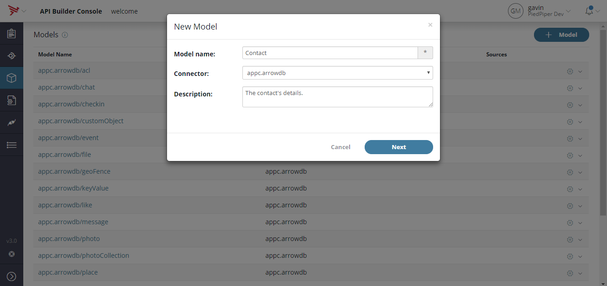
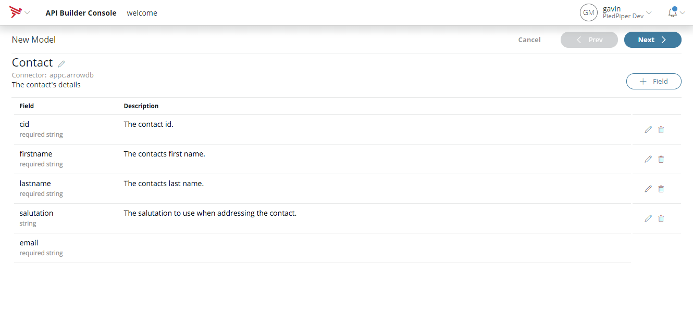
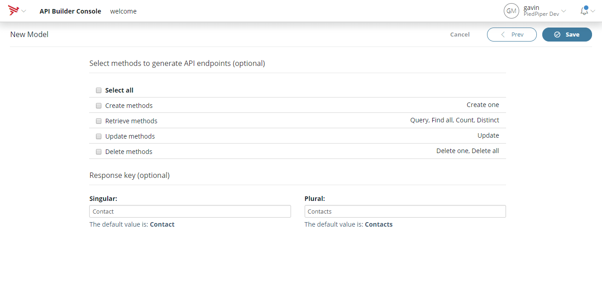
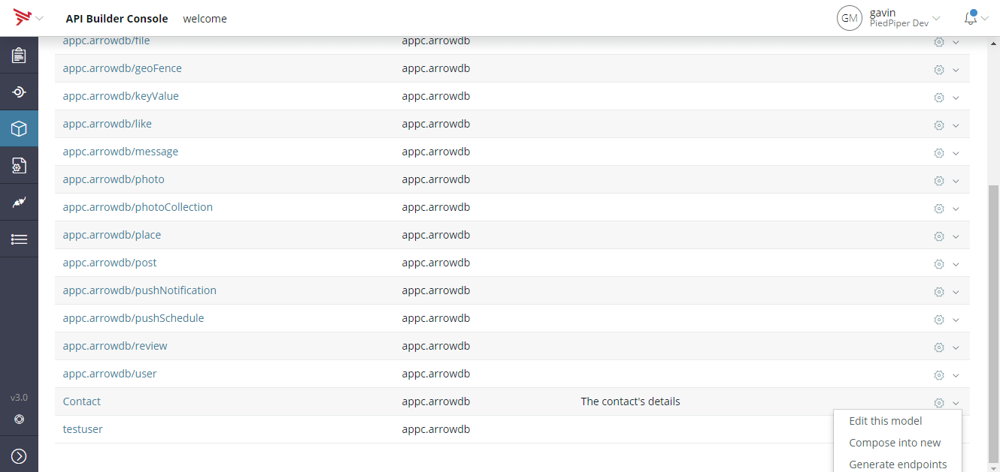
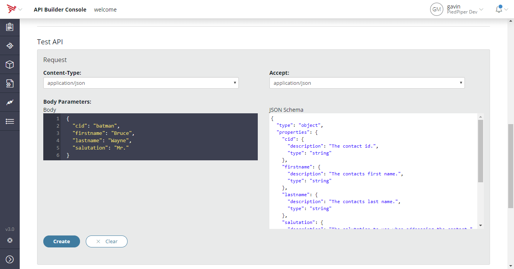
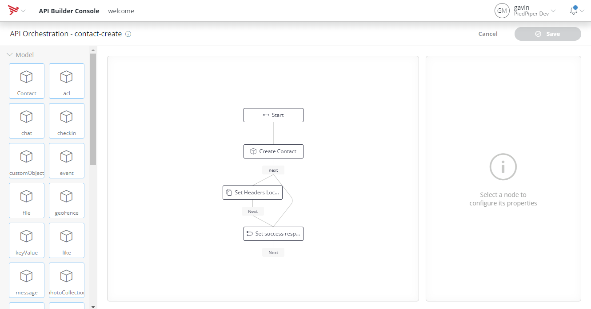

# 01 Model First

The goal here is to familiarize yourself with the models, endpoings and model-first creation.

## Create a model
Open the Models page by clicking on the Cube in the navigation bar or browse to http://localhost:8080/console/project/models and click on the +Models button.


Create a "Contact" model.


Add the fields cid, firstname, lastname and salutation:


No need to create the APIs for the model as we'll generate flow based endpoints later.


Save the model.

## Generate the Model-First endpoints
In previous versions of Arrow, Model-First development was done using the API Builder APIs (https://docs.axway.com/bundle/API_Builder_allOS_en/page/api_builder_apis.html#APIBuilderAPIs-APIendpointdefinition). The limitation with this approach is its inflexibility. The APIs exposed are not configurable or extensible. With flow based orchestration it's now possible to generate Model-First endpoints that are backed by flows. The interface for the generated endpoints closely mirrors the previous API based interface (e.g there's FindById, FindAll, DeleteAll, etc).

Navigate to the models page http://localhost:8080/console/project/models. Locate the "Contact" row and click on the cog at the end of the row. From the dropdown select _Generate endpoints_.


Select proceed on the dialog. Endpoint generation requires a server restart, this will happen automatically. Once restarted click on the _Go to API details_ link in the success dialog.


## File System
You've now created a number of files in your project directory.

```
welcome
│
└───models
│   │   Contact.js
│
└───endpoints
│   │   contact.json
|
└───flows
|   │   contact-count.json
|   │   contact-create.json
|   │   contact-delete.json
|   │   contact-deleteAll.json
|   │   contact-distinct.json
|   │   contact-findAll.json
|   │   contact-findAndModify.json
|   │   contact-findByID.json
|   │   contact-query.json
|   │   contact-update.json
|   │   contact-upsert.json
```

The _endpoint_ is the API definition. It is a Swagger v2 document that describes the API. The _flows_ contain the business logic for implementing the methods defined in the _endpoint_. The link from _endpoint_ method to _flow_ is via an _x-flow_ extensioin in the Swagger document. The _model_ defines the schema and interface for persisting data to the datastore (ArrowDB in this case).  

## Create test data
Previous versions of Arrow had a dedicated data import feature. This is not present in API Builder, however similar results can be achieved using the generated Model-First endpoints. Expand the _Create a Contact_ row.


The _Test API_ panel can be used to create test data in the database.


Use the panel to create the following entries:

```
{
  "cid": "batman",
  "firstname": "Bruce",
  "lastname": "Wayne",
  "salutation": "Mr."
}
```

```
{
  "cid": "spiderman",
  "firstname": "Peter",
  "lastname": "Parker"
}
```

```
{
  "cid": "wonderwoman",
  "firstname": "Diana",
  "lastname": "Prince",
  "salutation": "Ms."
}
```

```
{
  "cid": "superman",
  "firstname": "Clark",
  "lastname": "Kent",
  "salutation": "Mr."
}
```

To confirm the import use the _Find all Contact_ method:


Executing this should return data like:

```
[
  {
    "id": "5a1483d15bbb6a0275000ca0",
    "cid": "superman",
    "firstname": "Clark",
    "lastname": "Kent",
    "salutation": "Mr."
  },
  {
    "id": "5a1483b45bbb6a027f000c71",
    "cid": "wonderwoman",
    "firstname": "Diana",
    "lastname": "Prince",
    "salutation": "Ms."
  },
  {
    "id": "5a14838993e737027c000d54",
    "cid": "spiderman",
    "firstname": "Peter",
    "lastname": "Parker"
  },
  {
    "id": "5a1483635bbb6a0275000c9f",
    "cid": "batman",
    "firstname": "Bruce",
    "lastname": "Wayne",
    "salutation": "Mr."
  }
]
```

# Model-First Flows
The logic processing these API requests is implemented using flows. You can view the flow itself by clicking on the flow link for the model.


The flows editor will be discussed later but the flow for creating a contact will look like this:

