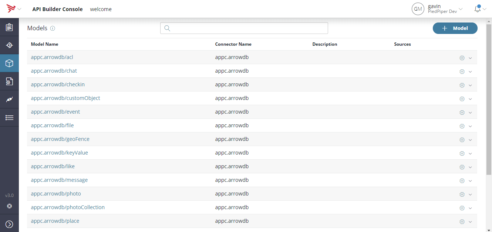
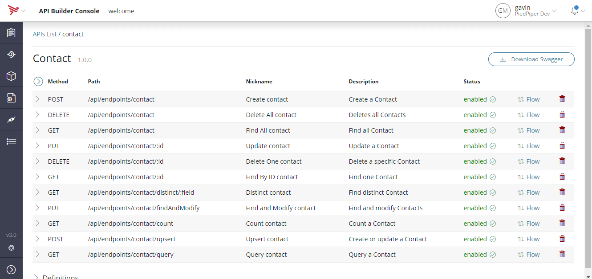

# API Builder Training 01

The goal here is to familiarize yourself with the models, endpoings and simple flow creation.

## Create a model
Open the Models page by clicking on the Cube in the navigation bar or browse to http://localhost:8080/console/project/models and click on the +Models button.

Create a "Contact" model.

Add the fields cid, firstname, lastname and salutation:

No need to create the APIs for the model as we'll generate flow based endpoints later.

Save the model.

## Generate the Model-First endpoints
In previous versions of Arrow, Model-First development was done using the API Builder APIs (https://docs.axway.com/bundle/API_Builder_allOS_en/page/api_builder_apis.html#APIBuilderAPIs-APIendpointdefinition). The limitation with this approach is its inflexibility. The APIs exposed are not configurable or extensible. With flow based orchestration it's now possible to generate Model-First endpoints that are backed by flows. The interface for the generated endpoints closely mirrors the previous API based interface (e.g there's FindById, FindAll, DeleteAll, etc).

Navigate to the models page http://localhost:8080/console/project/models. Locate the "Contact" row and click on the cog at the end of the row. From the dropdown select _Generate endpoints_.

Select proceed on the dialog. Endpoint generation requires a server restart, this will happen automatically. Once restarted click on the _Go to API details_ link in the success dialog.

## Create test data
