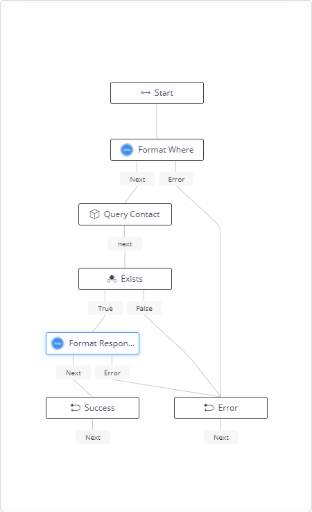
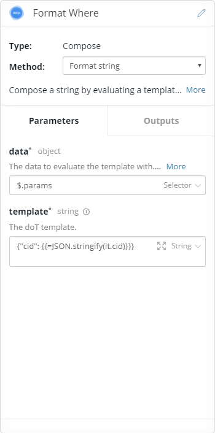
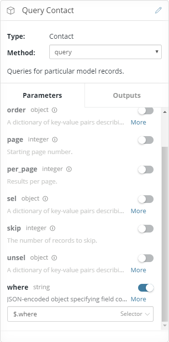
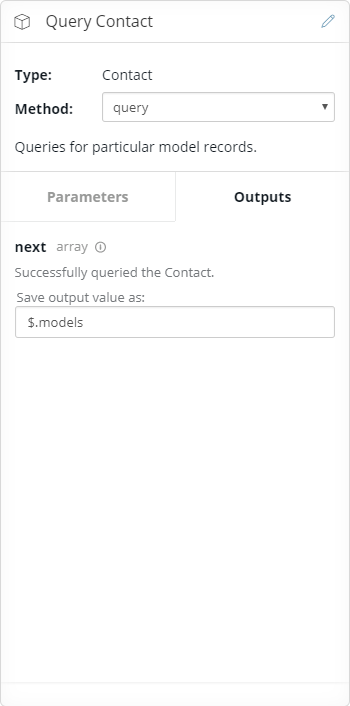
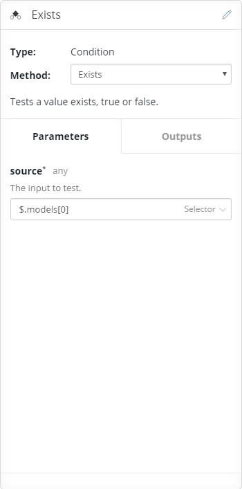
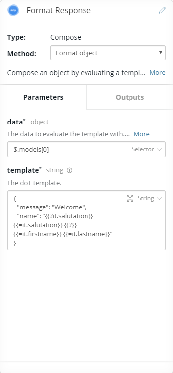
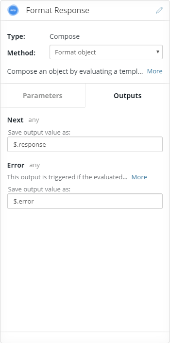
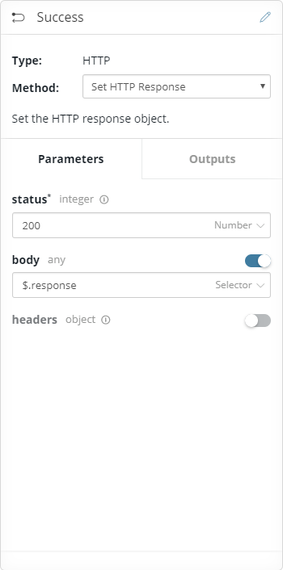
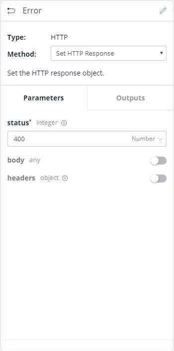

# 02 API First

We've just demostrated the Model-First approach, starting with a model and generating APIs that expose that model. _API First_ refers to doing things the other way round, starting with your API definition and building out the implementation.

## Import the API definition
Navigate to the API Endpoints page, http://localhost:8080/console/project/apidocs.


Click on the _+API_ button to add an API.


Select the _Welcome.json_ file in the Swagger folder or use the URL https://raw.githubusercontent.com/bladedancer/training/master/02_APIFirst/Swagger/Welcome.json

This API definition is just a contrived example. It has a single method on _/welcome_ that takes the contact id and responds with some data.


_Note:_ There are two save options, the _Save and mock_ will create a sample flow for the methods in the API. This may be useful when you need to have working APIs for testing but the logic is not important.

In this case we'll just select _Save_ as we'll be creating our flow.

## Implementing the API
The newly created endpoint is in a disabled state. This is because there are no flows associated with the methods.


To create the flow click on the _Create Flow_ link.

Giving a step by step of dragging the pieces into place and renaming them would be tedious, so instead here's how the final flow should look.



This flow is centered around a _query_ on the contact model. The endpoint will pass in the request parameters under _$.params_. These parameters are formated for use with the _query_ and then the result is formatted and outputed to the response.

### Format Where
*Type:* Compose

*Method:* Format string

The model query method expects a _where_ condition as a JSON encoded string. This node takes the _cid_ value from the parameters and encodes it into a string that can be used as the _where_ clause for the query.

 

The Compose node uses _doT_ templates, see http://olado.github.io/doT/ for more detail. The template here is taking the cid and JSON stringifying it.

```
{"cid": {{=JSON.stringify(it.cid)}}}
```

Note also that the value of the evaluated template in the _Next_ output is stored as _$.where_. This will be used as input for the query node.

### Query Contact
*Type:* Conatact

*Method:* query

The model query node calls [query](http://docs.appcelerator.com/platform/latest/#!/api/Arrow.Model-method-query). Here we are just going to pass a _where_ value to select the contact.

 

Note that the _next_ ouput is saving the result to _$.models_. The response from query will be an array of matching models (we'll be assuming at most 1).

### Exists
*Type:* Condition

*Method:* Exists

As query returns an array we need to check if the array contains anything. One way of doing this is to check for the existence of the first element.



The test is checking for the existence of _$.models[0]_, the first element in the array returned by _Query Contact_.

As this is just a simple example the _False_ path just routes to the the _Error_ node which we'll see later just returns a 400. However in a more real world scenario it would likely route to a different error node and return a 404.

### Format Response
*Type:* Compose

*Method:* Format object

The endpoint is defined as returning:

```
"schema": {
	"type": "object",
	"properties": {
		"message": { "type": "string" },
		"name": { "type": "string" }
	}
}
```

The _Format Response_ node is being used to create the data for the response. It's using the _Compose_ node and a _doT_ template to construct the return value.

 

The template is concatinating the contact's name details in to a single string:

```
{
  "message": "Welcome",
  "name": "{{?it.salutation}}{{=it.salutation}} {{?}}{{=it.firstname}} {{=it.lastname}}"
}
```

Note the _Next_ output is saving the evaluated template as _$.response_, this will be used in the _Success_ node.

### Success
*Type:* HTTP

*Method:* Set HTTP Response

This node allows us to set the values we want to use for the response. In this case we're returning a 200 status code with _$.response_ as the body. Note the body is always _application/json_ encoded.



### Error
*Type:* HTTP

*Method:* Set HTTP Response

This node allows us to set the values we want to use for the response. In this case we're returning a 400 status code to indicate a _Bad Request_ error.




## Testing the API

Save the flow, this will take you back to the API summary view. Expand the API should no longer be disabled. Expand the row and scroll to the _Test API_ section. Try executing with a _cid_ of _batman_. The response should be:

```
{
  "message": "Welcome",
  "name": "Mr. Bruce Wayne"
}
```
