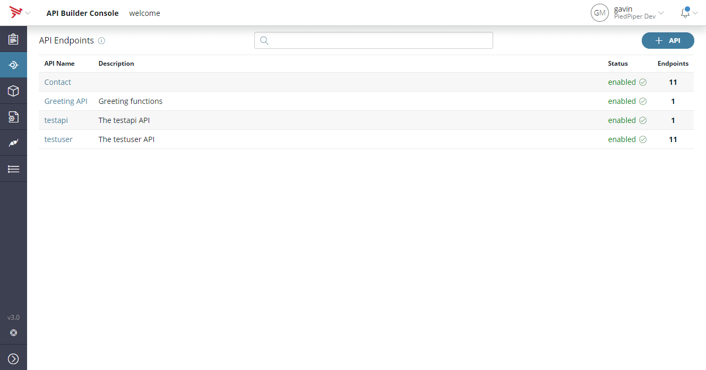
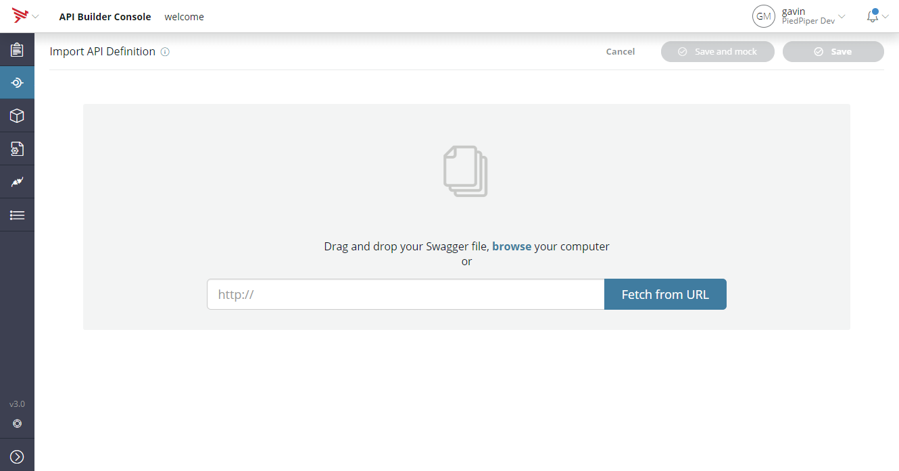
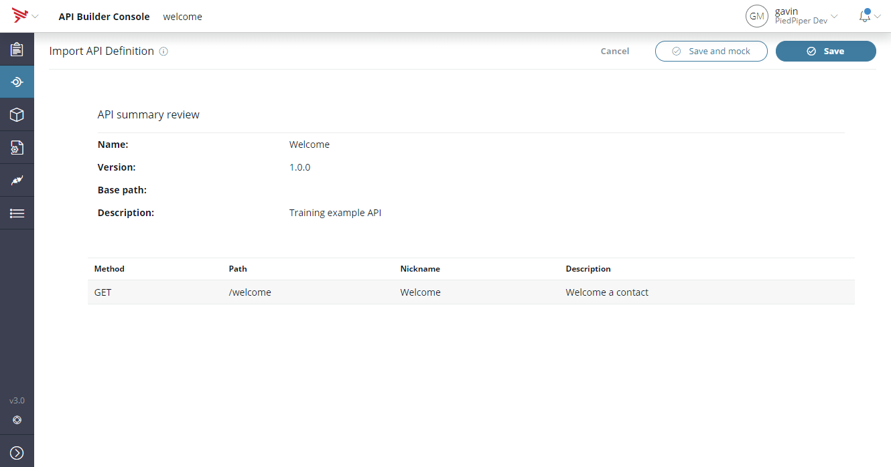
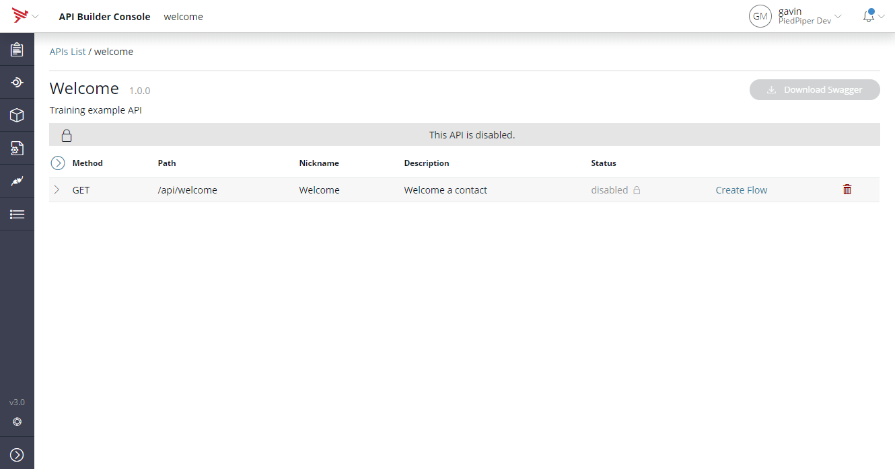

# 02 API First

We've just demostrated the Model-First approach, starting with a model and generating APIs that expose that model. _API First_ refers to doing things the other way round, starting with your API definition and building out the implementation.

## Import the API definition
Navigate to the API Endpoints page, http://localhost:8080/console/project/apidocs.

Click on the _+API_ button to add an API.

Select the _Welcome.json_ file in the Swagger folder or use the URL https://raw.githubusercontent.com/bladedancer/training/master/02_APIFirst/Swagger/Welcome.json

This API definition is just a contrived example. It has a single method on _/welcome_ that takes the contact id and responds with some data.

_Note:_ There are two save options, the _Save and mock_ will create a sample flow for the methods in the API. This may be useful when you need to have working APIs for testing but the logic is not important.

In this case we'll just select _Save_ as we'll be creating our flow.

## Implementing the API
The newly created endpoint is in a disabled state. This is because there are no flows associated with the methods.

To create the flow click on the _Create Flow_ link.
