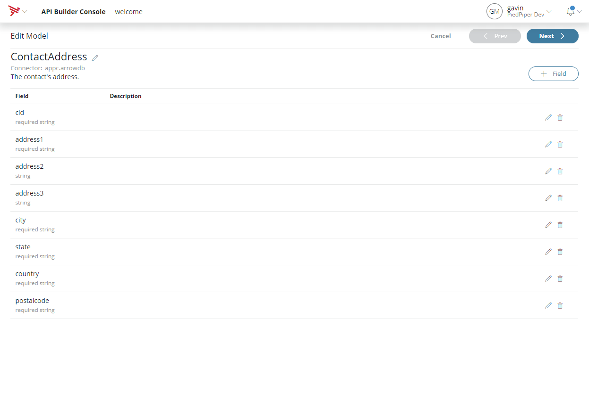
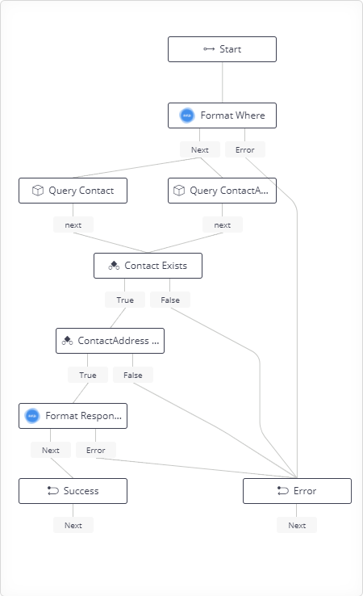
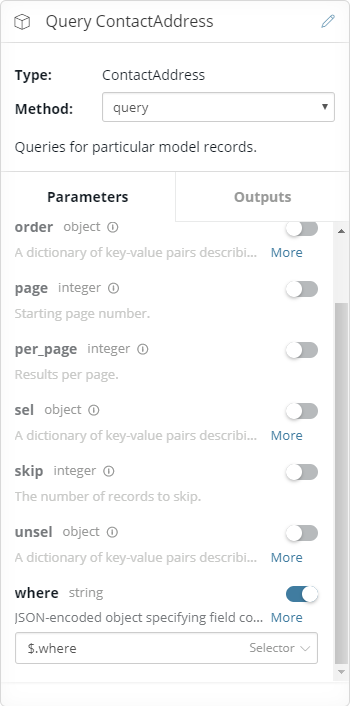
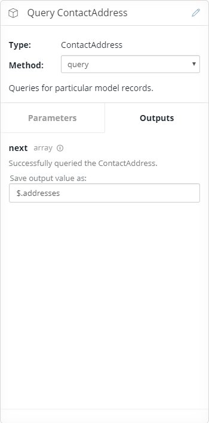
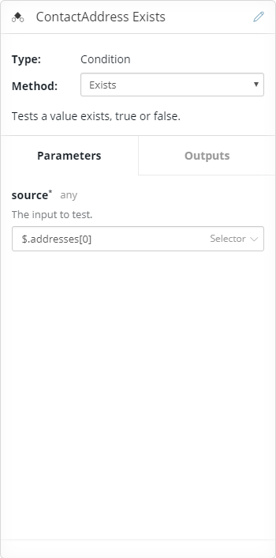
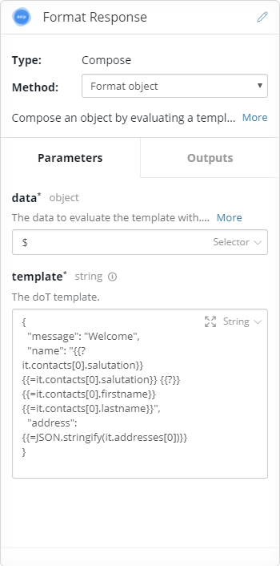

# 03 Composite

One of the many features of API Builder Connectors is the ability to compose a model from multiple datasources. However this is often a black box and sometimes unnecessarily complicated. An alternative is to use flows to query multiple data sources in parallel and compose the responses into the desired format.

For this example we'll build on the Welcome API and flow that we've already created. As well as querying the users name we're now going to query their address.

## Create the ContactAddress model
For simplicilty we'll be creating this model in ArrowDB also but the real power of this feature is that it allows you to combine data from disparate data sources....so imagine this is a MySql database or some other database.

This is the exact same process used to create the _Contact_ model so we won't go into two much detail. Create a ContactAddress model with  _cid_, _address1_, _address2_, _address3_, _city_, _state_,_country_ and _postcode_ fields.



No need for the generated API endpoints. Save the model. As before _Generate endpoints_ for the newly created model.

## Create test data
Go to the API details for the newly created _ContactAddress_ API, http://localhost:8080/console/project/endpoints/contactaddress.

Expand the _Create a ContactAddress_ row and using the _Test API_ panel create the following data:

```
{
  "cid": "batman",
  "address1": "Wayne Manor",
  "address2": "107 Mountain Drive",
  "city": "Gotham City",
  "state": "NY",
  "country": "USA",
  "postalcode": "0"
}
```
```
{
  "cid": "spiderman",
  "address1": "20 Ingram Street",
  "address2": "Forest Hills Gardens",
  "address3": "Queens",
  "city": "New York",
  "state": "NY",
  "country": "USA",
  "postalcode": "11375"
}
```
```
{
  "cid": "wonderwoman",
  "address1": "Somewhere",
  "city": "Themyscira",
  "state": "Themyscira",
  "country": "Themyscira",
  "postalcode": "Themyscira"
}
```
```
{
  "cid": "superman",
  "address1": "Main st",
  "city": "Aughrim",
  "state": "Co. Wicklow",
  "country": "Ireland",
  "postalcode": ""
}
```

## Update the flow
The idea here is that the flow will query the two models in parallel and then combine the result. Open the _Welcome_ flow again, http://localhost:8080/console/project/flows/welcome-Welcome/edit

For clarity the output of _Query Contact_ has been renamed from _$.models_ to _$.contacts_.



The updated flow has two new nodes _Query ContactAddress_ and _ContactAddress Exists_. The two model queries will run in parallel and processing won't proceed to _Contact Exists_ until both are complete.

### Query ContactAddress
*Type:* ConatactAddress

*Method:* query

The model query node calls [query](http://docs.appcelerator.com/platform/latest/#!/api/Arrow.Model-method-query). Here we are just going to pass a _where_ value to select the contact address.

 

Note that the _next_ ouput is saving the result to _$.addresses_. The response from query will be an array of matching models (we'll be assuming at most 1).

### ContactAddress Exists
*Type:* Condition

*Method:* Exists

As before, query returns an array so we need to check if the array contains anything. One way of doing this is to check for the existence of the first element.



The test is checking for the existence of _$.addresses[0]_, the first element in the array returned by _Query ContactAddress_. For now we're assuming not having an address is an error.

### Format Response
*Type:* Compose

*Method:* Format object

The _Format Response_ node needs to be updated so that it includes the new data in the response. Also as the result of _Query Contact_ was moved from _$.models_ to _$.contacts_ that needs to be updated also.

The _Format Response_ node is being used to create the data for the response. It's using the _Compose_ node and a _doT_ template to construct the return value.



The template is concatinating the contact's name details in to a single string and including the address:

```
{
  "message": "Welcome",
  "name": "{{?it.contacts[0].salutation}}{{=it.contacts[0].salutation}} {{?}}{{=it.contacts[0].firstname}} {{=it.contacts[0].lastname}}",
  "address": {{=JSON.stringify(it.addresses[0])}}
}
```

Note that the _data_ from the template was changed from _$.models[0]_ to _$_. This means it gets the entire context and can access any values stored there, but it does make things more verbose, e.g. _it.salutation_ to _it.contacts[0].salutation_. There is now an addition field for address - it is just dumping the address from the query into the response.

## Update the endpoint definition
As mentioned previously the endpoint is defined as returning:

```
"schema": {
	"type": "object",
	"properties": {
		"message": { "type": "string" },
		"name": { "type": "string" }
	}
}
```

This no longer matches what the flow is returning. So we need to update the endpoint to include the new _address_ field. There is no edit API capability in the UI yet but the endpoint is just a Swagger document and can be edited directly on the filesystem.

Stop API Builder and open  _endpoints\welcome.json_. Change the response to include _address_:

```
"responses": {
	"200": {
		"description": "Welcome message",
		"schema": {
			"type": "object",
			"properties": {
				"message": {
					"type": "string"
				},
				"name": {
					"type": "string"
				},
				"address": {
					"$ref": "schema:///model/ContactAddress"
				}
			}
		}
	},
	...
}
```

Note every model's schema is registered on startup and so rather than having to list the fields of a _ContactAddress_ we can just refer to the schema directly.

## Test the API
As before, using the _Test API_ panel execute with _cid_ of _batman_ and you should see results like:

```
{
  "message": "Welcome",
  "name": "Mr. Bruce Wayne",
  "address": {
    "id": "5a15679493e7370284001471",
    "cid": "batman",
    "address1": "Wayne Manor",
    "address2": "107 Mountain Drive",
    "city": "Gotham City",
    "state": "New York",
    "country": "USA",
    "postalcode": "0"
  }
}
```
