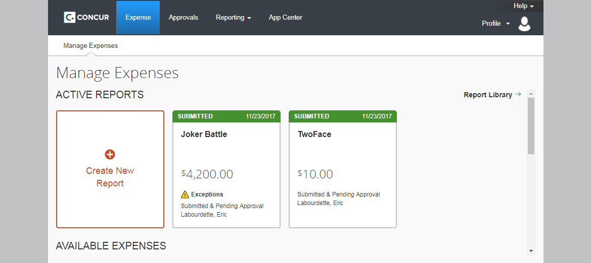
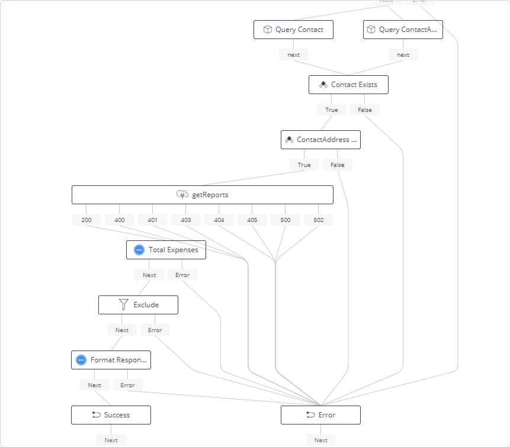
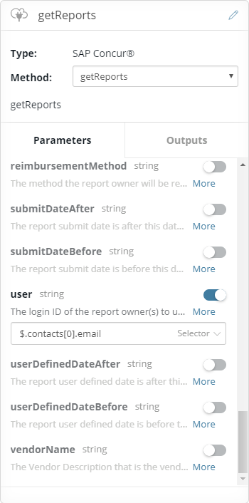
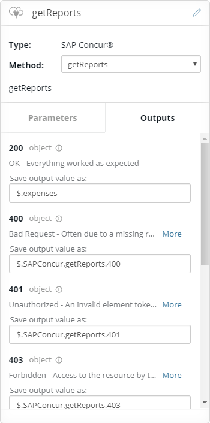
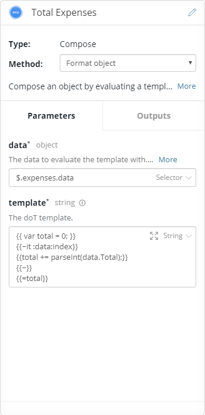
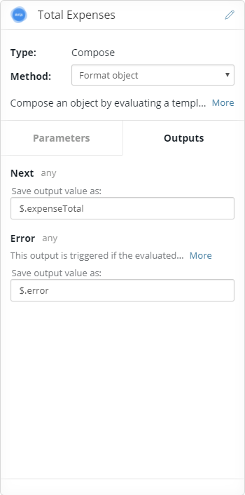

# 05 Service Connector

Service Connectors are similar to the nodes created by the Flow SDK. The are extensions that install custom nodes for use in the Flow Editor. However in this case they provide access to external REST services e.g. ZenDesk, Twitter, Facebook, etc.

## Installation

In production these services will be available for download from the Axway Marketplace. The service connector is downloaded as a zip and extracted into the _serviceconnectors_ folder of your application.

_Note:_ This is currently a packed module, future versions of API Builder may just ```npm install``` them. For now after unzipping the download rename the _package_ folder to something more meaningful.

A number of these service connectors were developed in conjuction with Cloud Elements and require the installation of a supporting module _requester-ce_.

Download the connector (from internal registy for now - this will change on release):
```
http://registry.ecd.axway.int:8081/artifactory/local-npm/appc.concur/-/appc.concur-1.0.3-42.tgz
```

Extract the tgz, you should have a folder called _package_. Copy this folder to the _serviceconnectors_ folder and rename it _concur_. Note if this is your first service connector you will need to create the _serviceconnectors_ folder first. Also install the required modules for the connector:

```
npm install -S requester-ce
```

If this hasn't been published to NPMJS then you might need to install from the internal registry:

```
npm --registry http://registry.ecd.axway.int:8081/artifactory/api/npm/registry-npm install -S requester-ce
```

Restart the API Builder console and you should now see the _Concur_ connector.


This new node can now be used in the flow like any other node. Concur is for an expense tracking, so in this contrived example we'll query the pending expenses for the contact.


## Updated Use case

Concur is an expenses tracking application, so we will extend the flow to query and total the users expenses and include that in the response. Batman's Concur expenses look like this:



We're going to add the Concur node to the flow with the _getReports_ method. Then we'll ues a _Compose_ node to total the expenses.



*Note:* This flow is starting to show some of the issues with the current layout engine, this will be improved in the future.

### Get User Expenses
*Type:* SAP Concur

*Method:* getReports

As this node is going to user the contact's email as the user filter it needs to run after the _Query Contact_ node. It has a number of outputs for the various error codes, we'll just route them all to the same _Error_ node for this demo.

 

The connector requires an authentication token _x-vendor-authorization_. Also set the _user_ filter to _$.contacts[0].email_. The success output _200_ saves the result in _$.expenses_.


### Total Expenses
*Type:* Compose

*Method:* Format object

The _Compose_ node is quite powerful and can be used to evaluate code. It's generally better to create custom nodes or codeblocks for tasks like this but just to show it can be done with the _Compose_ node.

 

The template is using the evaluation and iteration features of [dot](http://olado.github.io/doT/).

```
{{ var total = 0; }}
{{~it :data:index}}
{{total += parseInt(data.Total);}}
{{~}}
{{=total}}
```

The output of the template evaluation is stored as _$.expenseTotal_.


### Format Response
*Type:* Compose

*Method:* Format object

Update the _Format Response_ node to include the expenses in it's template:

```
{
  "message": "Welcome",
  "name": "{{?it.contacts[0].salutation}}{{=it.contacts[0].salutation}} {{?}}{{=it.contacts[0].firstname}} {{=it.contacts[0].lastname}}",
  "address": {{=JSON.stringify(it.address)}},
  "expenses":  {{=it.expenseTotal}}
}
```

## Update the endpoint definition

As before, we're changing the response and so should update the endpoint definition to include this new field. Currently this has to be done on the file system.

Stop API Builder and open  _endpoints\welcome.json_. Change the response to include _expenses_:

```
"schema": {
	"type": "object",
	"properties": {
		"message": {
			"type": "string"
		},
		"name": {
			"type": "string"
		},
		"address": {
			"$ref": "schema:///model/ContactAddress"
		},
		"expenses": {
			"type": "number"
		}
	}
}
```

## Test API

Open the _Test API_ panel for the _Welcome_ API and execute it with a _cid_ of _batman_. The response should now include the expenses total:

```
{
  "message": "Welcome",
  "name": "Mr. Bruce Wayne",
  "address": {
    "address1": "Wayne Manor",
    "address2": "107 Mountain Drive",
    "city": "Gotham City",
    "state": "New York",
    "country": "USA",
    "postalcode": "0"
  },
  "expenses": 4210
}
```
