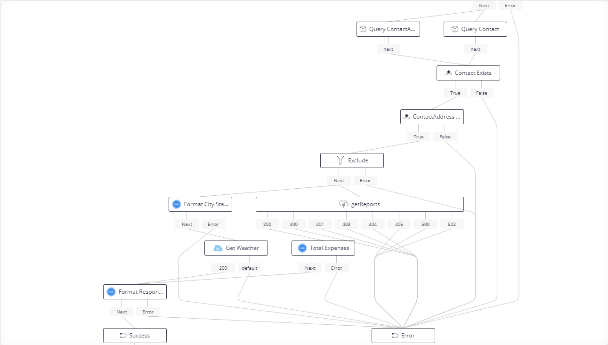
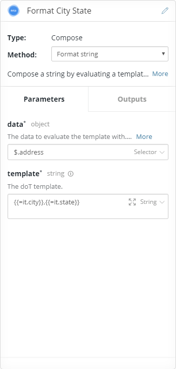
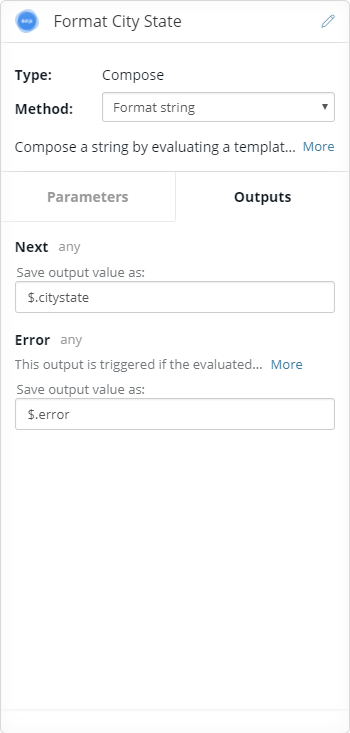
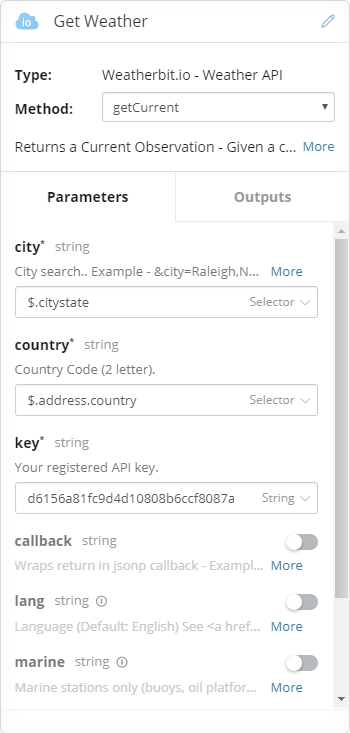
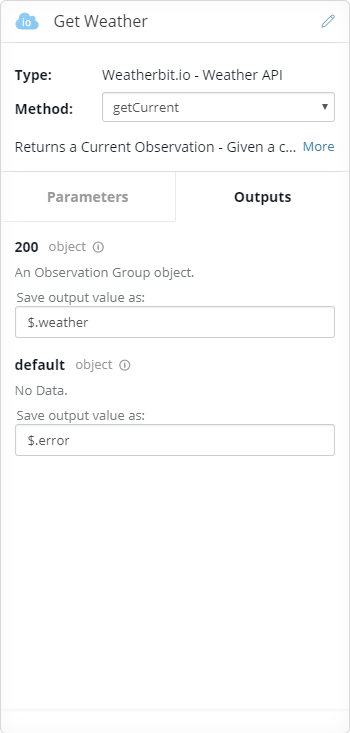

# NOT PRODUCTION READY DO NOT USE

# 06 Connector Builder

Connector Builder is a tool to allow you to create _Service Connectors_. You provide the _Swagger_ definition for the API and it will create a service connector that can then be used in a flow to interact with the backend service.

## Installation

Like the Axway Flow SDK this is a tool that you can install globally:

```
npm install -g connector-builder
```

If it's not publicly available yet then it can be installed from the internal registry:

```
npm --registry http://registry.ecd.axway.int:8081/artifactory/api/npm/registry-npm install -g connector-builder
```

Once installed you can run the builder using ```connector-builder```.

## Create a weather connector

Let's say we're big fans of _Weatherbit.io_ and want to use it in our flow. There's no node available but that's not a problem. We can create one.

We need the Swagger definition for the service: https://raw.githubusercontent.com/bladedancer/training/master/06_ConnectorBuilder/swagger/weatherbitio.json

** Note this was not the best choice of API as the swagger is actually not valid - it has query parameters set in the path and defined as path params. Connector Builder actually worked with it but that's unexpected and can't be relied on to remain that way so the swagger on disk has been updated (at least for the _getCurrent_ method that this flow is using).

Run ```connector-builder i``` to start the wizard.

```
w:\training\06_ConnectorBuilder>connector-builder i
? Enter the name of the connector you want to generate: weatherbitio
? Enter the URL or the path (absolute or relative) to the API definition: .\swagger\weatherbitio.json
? Select the Connector Type: Open API
? Select the Context where the Connector will be used: API Builder
? Enter the absolute path to the location where the connector will be generated (leave empty for current dir):
? Do you want to remove previous connector if it is already exist? Yes
```

Before building you can replace _icon.svg_ with the logo of the service.

You also need to install the axway-requester module which may not be on the public npm registery. 

```
npm install -S axway-requester
```
If its not on the public registry install it with:

```
npm --registry http://registry.ecd.axway.int:8081/artifactory/api/npm/registry-npm install -S axway-requester
```
Then build all:

```
npm run all
npm pack
```

## Install the connector

This is the same as installing a downloaded service connector. Unzip the packed tgz to the serviceconnectors folder of your app.


Start the API Builder console and navigate to the _Welcome_ flow: http://localhost:8080/console/project/flows/welcome-Welcome/edit

The _Weatherbit.io_ node is now available:


## Updating the flow

As well as getting the contacts expenses we also want to get the weather in their area.



Note the flow layout could be better, there are plans to improve the layout engine.

There's a minor reorganization to move exclude before the service conenctors, just for readability. The addition here is a _Compose_ node to format the city & state into a single string for the _WeatherBit_ method and the addition of the  _WeatherBit_ service connector to get the weather.


### Format City State
*Type:* Compose

*Method:* Format string

The _getCurrent_ API that we're going to call take the city as _city,state_ so just format the string appropriately.

 

The template could be more robust but for now it's just:

```
{{=it.city}},{{=it.state}}
```

The output of the template evaluation is stored as _$.citystate_.


### Get Weather
*Type:* Weatherbit.io - Weather API

*Method:* getCurrent

This is the _service connector_ we've just created. The methods on it are the methods defined in the swagger document. For this example we're calling _getCurrent_ with the contacts address details.

 

The city is ```$.citystate```, from the _Format City State_ output. The country is straight from the contact address _$.address.country_. And you can sign up at weatherbit.io to get an api key.

The output is stored as _$.weather_.

Note: This is pretty brittle, if there is an error in the parameters it will trigger an exception in the response parsing and abort the flow (user gets a 500).


### Format Response
*Type:* Compose

*Method:* Format object

Update the _Format Response_ node to include the weather in it's template:

```
{
  "message": "Welcome",
  "name": "{{?it.contacts[0].salutation}}{{=it.contacts[0].salutation}} {{?}}{{=it.contacts[0].firstname}} {{=it.contacts[0].lastname}}",
  "address": {{=JSON.stringify(it.address)}},
  "expenses": {{=it.expenseTotal}},
  "weather": "{{=it.weather.data[0].weather.description}}"
}
```

## Update the endpoint definition

As before, we're changing the response and so should update the endpoint definition to include this new field. Currently this has to be done on the file system.

Stop API Builder and open  _endpoints\welcome.json_. Change the response to include _weather_:

```
"schema": {
	"type": "object",
	"properties": {
		"message": {
			"type": "string"
		},
		"name": {
			"type": "string"
		},
		"address": {
			"$ref": "schema:///model/ContactAddress"
		},
		"expenses": {
			"type": "number"
		},
		"weather": {
			"type": "string"
		}
	}
}
```

## Test API

Open the _Test API_ panel for the _Welcome_ API and execute it with a _cid_ of _batman_. The response should now include the weather description:

```
{
  "message": "Welcome",
  "name": "Mr. Bruce Wayne",
  "address": {
    "address1": "Wayne Manor",
    "address2": "107 Mountain Drive",
    "city": "New York",
    "state": "NY",
    "country": "US",
    "postalcode": "0"
  },
  "expenses": 4210,
  "weather": "Clear sky"
}
```
