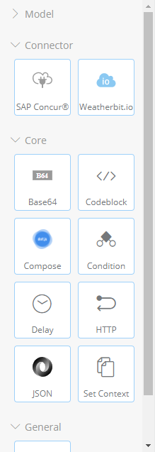

h1. NOT PRODUCTION READY DO NOT USE

# 06 Connector Builder

Connector Builder is a tool to allow you to create _Service Connectors_. You provide the _Swagger_ definition for the API and it will create a service connector that can then be used in a flow to interact with the backend service.

## Installation

Like the Axway Flow SDK this is a tool that you can install globally:

```
npm install -g connector-builder
```

If it's not publicly available yet then it can be installed from the internal registry:

```
npm --registry http://registry.ecd.axway.int:8081/artifactory/api/npm/registry-npm install -g connector-builder
```

Once installed you can run the builder using ```connector-builder```.

## Create a weather connector

Let's say we're big fans of _Weatherbit.io_ and want to use it in our flow. There's no node available but that's not a problem. We can create one.

We need the Swagger definition for the service: https://www.weatherbit.io/static/swagger.json

Run ```connector-builder i``` to start the wizard.

```
w:\training\06_ConnectorBuilder>connector-builder i
? Enter the name of the connector you want to generate: weatherbitio
? Enter the URL or the path (absolute or relative) to the API definition: .\swagger\weatherbitio.json
? Select the Connector Type: Open API
? Select the Context where the Connector will be used: API Builder
? Enter the absolute path to the location where the connector will be generated (leave empty for current dir):
? Do you want to remove previous connector if it is already exist? Yes
```

Before building you can replace _icon.svg_ with the logo of the service.
Then build all:

```
npm run all
npm pack
```

## Install the connector

This is the same as installing a downloaded service connector. Unzip the packed tgz to the serviceconnectors folder of your app.

```
npm install -S axway-requester
```

Start the API Builder console and navigate to the _Welcome_ flow: http://localhost:8080/console/project/flows/welcome-Welcome/edit

The _Weatherbit.io_ node is now available:


